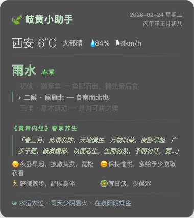

# tcm-widget

macOS 桌面小组件 **岐黄小助手** 🍃 —— 每日养生提醒，中医智慧浮于桌面。

> **声明：纯属自己玩玩，Just for fun。不构成医疗建议。**

  



## 数据内容

每天 7:00 自动更新：
- 📅 农历 / 干支纪年
- 🌤 实时天气（西安）
- 🌿 二十四节气 + 七十二物候
- 📜 《黄帝内经》当季养生原文与起居指导
- ☯️ 五运六气

## 适用环境

| 条件 | 要求 |
|------|------|
| 系统 | **macOS** 10.10+ |
| 依赖 | [Übersicht](http://tracesof.net/uebersicht/) 桌面组件引擎 |
| 网络 | SSH 访问数据源服务器（Tailscale 内网） |

⚠️ 需自行搭建后端数据源，或修改 `fetch_tcm.sh` 指向自己的服务器。

## 安装

```bash
# 1. 安装 Übersicht
brew install --cask ubersicht
# 或从官网下载: http://tracesof.net/uebersicht/

# 2. 克隆仓库
git clone https://github.com/shaoguos/tcm-widget.git
cd tcm-widget

# 3. 修改 fetch_tcm.sh 中的 SSH 地址为你自己的服务器
vim fetch_tcm.sh

# 4. 链接组件到 Übersicht
ln -s "$(pwd)/tcm-widget.widget" ~/Library/Application\ Support/Übersicht/widgets/tcm-widget.widget

# 5. 打开 Übersicht，桌面即出现组件
open -a Übersicht
```

## 文件说明

```
tcm-widget/
├── tcm-widget.widget/
│   └── index.jsx          # Übersicht 桌面组件（JSX + CSS）
├── fetch_tcm.sh           # SSH 数据拉取脚本
└── README.md
```

## 技术细节

- **桌面引擎**: [Übersicht](http://tracesof.net/uebersicht/) — HTML/CSS/JS 渲染的 macOS 桌面组件
- **数据传输**: SSH + `cat latest.json`（轻量，无需 HTTP 服务）
- **刷新频率**: 每 30 分钟
- **视觉**: 毛玻璃背景 + 暗色主题，与 macOS 桌面融合

## 相关项目

- [璇玑星图](https://github.com/shaoguos/star-chart) — 配套桌面星图组件（北斗七星 + 二十八宿 + 节气环）

## License

MIT
